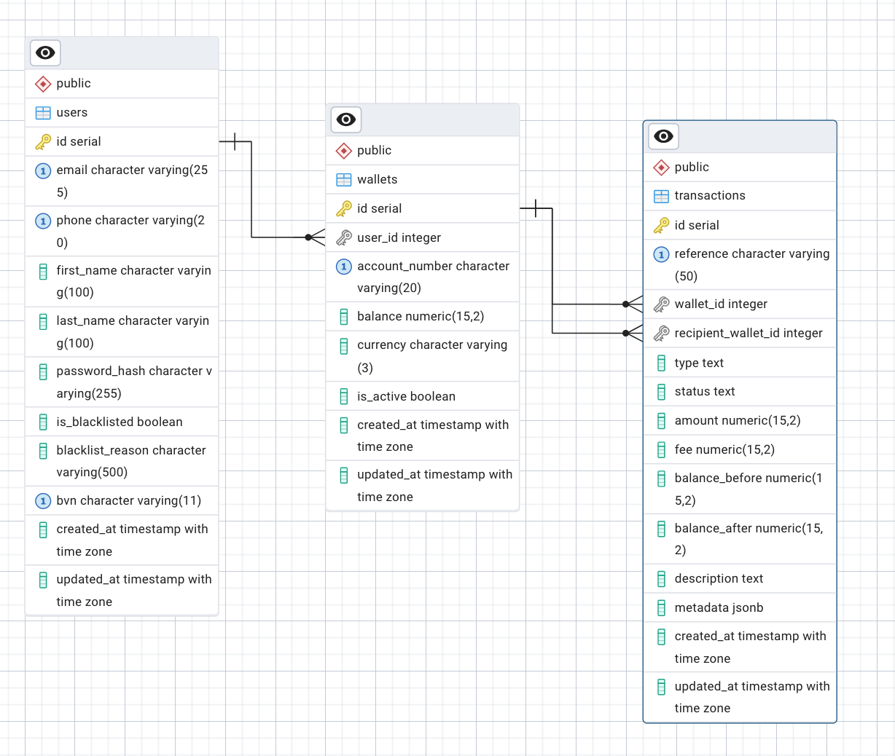

# TypeScript SMS API



## Overview
This project is a TypeScript-based RESTful API for user and wallet management, built with Express, Knex.js, and PostgreSQL. It demonstrates best practices in backend architecture, code quality, and transactional integrity for financial operations.

---

## Design Document

### 1. Architecture & Structure
- **Layered Architecture:**
  - **Controllers:** Handle HTTP requests and responses.
  - **Processors:** Contain business logic and validation.
  - **Models:** Handle database access and queries.
  - **Middleware:** For authentication, error handling, and response formatting.
- **Separation of Concerns:** Each layer is responsible for a single aspect of the application, making the codebase maintainable and testable.
- **OOP Principles:** Classes and inheritance are used for controllers, processors, and models.

### 2. User Module
- **Registration:**
  - Validates input using Joi schemas.
  - Checks for duplicate email/phone and blacklist status.
  - Hashes password and creates user and wallet records.
  - Returns a JWT token and wallet info on success.
- **Login:**
  - Validates credentials and checks blacklist status.
  - Returns JWT token and wallet info on success.
- **Profile:**
  - Requires authentication (JWT).
  - Returns user and wallet details.
- **Validation:**
  - All input validation is handled via Joi schemas for consistency and security.

### 3. Wallet Module
- **Funding:**
  - Adds funds to a wallet and logs the transaction.
  - Uses a database transaction to ensure atomicity.
- **Transfer:**
  - Moves funds between wallets, creating debit and credit transactions.
  - Uses a database transaction to ensure both wallets are updated atomically.
- **Withdrawal:**
  - Deducts funds from a wallet and logs the transaction.
  - Uses a database transaction for atomicity.
- **Balance & Transactions:**
  - Endpoints to fetch wallet balance and transaction history.

### 4. Database Design
- **Users Table:** Stores user info and credentials.
- **Wallets Table:** Each user has a wallet with a balance and account number.
- **Transactions Table:** Logs all wallet operations (funding, transfer, withdrawal) with before/after balances.
- **Referential Integrity:** Foreign keys ensure data consistency.

### 5. Transaction Scoping
- **All multi-step wallet operations (funding, transfer, withdrawal) are wrapped in database transactions.**
- **Guarantees:**
  - No partial updates (atomicity)
  - Consistent balances
  - Reliable transaction logs

### 6. API Design
- **RESTful endpoints:**
  - `/api/v1/users/register`, `/login`, `/profile`
  - `/api/v1/wallets/fund`, `/transfer`, `/withdraw`, `/balance`, `/transactions`
- **JWT Authentication:** Required for all wallet and profile endpoints.
- **Consistent error and success response structure.**

### 7. Testing
- **Unit and E2E tests** for all user and wallet flows, covering both positive and negative scenarios.
- **Supertest** is used for HTTP endpoint testing.
- **Jest** is used as the test runner.

### 8. Code Quality & Best Practices
- **DRY Principle:** Business logic is centralized in processors.
- **Consistent naming and conventions.**
- **Semantic resource and path naming.**
- **Attention to error handling and validation.**
- **Well-organized folder structure.**

---

## Getting Started

1. **Install dependencies:**
   ```bash
   npm install
   ```
2. **Configure environment:**
   - Copy `.env.example` to `.env` and set your DB and JWT secrets.
3. **Run migrations and seeds:**
   ```bash
   npm run migrate
   npm run seed
   ```
4. **Rollback migrations (if needed):**
   ```bash
   npm run migrate:rollback
   ```
5. **Start the server:**
   ```bash
   npm run dev
   ```
6. **Run tests:**
   ```bash
   npm test
   ```

---

## API Reference

See the codebase and test files for detailed request/response examples for each endpoint.

---

## License
ISC 